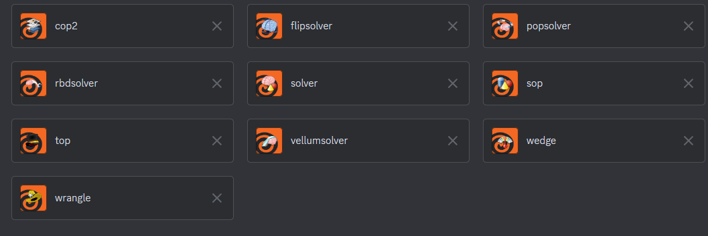

# Houdini Discord Presence

## Installating requirements:

Take note of your Houdini Python version, and then navigate to the package folder, and do `pip install -r requirements`. (Install in your standard python installion on your machine)

## Usage

When Houdini starts, an RPC server is opened on port 9900 and connected to by the script `call.py`. This will pull your currently selected node and update your Discord presence based on this. You can add more lines to `types.json` and have them be detected.

Currently, I have uploaded these icons:


If you have more to add, please send me a message.

### Customization

This tool pulls the `node.type().name()` of the selected node. You can add more to `types.json`. If you are really kind, you will make a pull request to add some more fun to this.

## Installation

It's a package. Drop `HDP.json` in your packages folder and update the path to reflect where the folder is.

## Contributing

To contribute to this project, follow these steps:

1. Fork the repository by clicking on the "Fork" button at the top right corner of the repository page.
2. Clone the forked repository to your local machine using the following command:
    ```
    git clone https://github.com/your-username/repository-name.git
    ```
3. Create a new branch for your changes using the following command:
    ```
    git checkout -b your-branch-name
    ```
4. Make the necessary changes to the codebase.
5. Commit your changes with a descriptive commit message using the following command:
    ```
    git commit -m "Your commit message"
    ```
6. Push your changes to your forked repository using the following command:
    ```
    git push origin your-branch-name
    ```
7. Go to the original repository on GitHub and click on the "New Pull Request" button.
8. Provide a meaningful title and description for your pull request, explaining the changes you have made.
9. Submit the pull request for review by the project maintainers.
